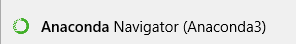
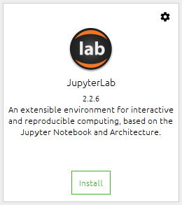
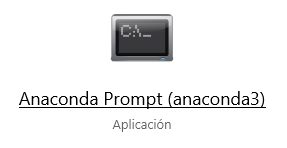
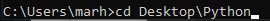
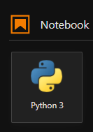
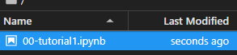
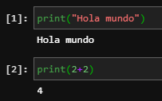

# Guía de instalación 

## Instalar Anaconda 3
Seguir la guía en el siguiente enlace
- [Instalación de Anaconda](https://docs.anaconda.com/anaconda/install/)

## Instalar JupyterLab

1. Una vez instalado Anaconda 3, abrimos el Anaconda Navigator desde el buscador de programas.



2. Desde el navegador, buscamos la aplicación de JupyterLab y le hacemos click en "Install".



## Correr Notebooks de Jupyter
### Windows
1. Buscar la aplicación de Símbolo del Sistema, escribiendo "cmd" en el buscador de programas.



1. Una vez la pantalla de Anaconda Prompt esté abierta, puede navegar a la carpeta donde se encuentra el notebook que quiere correr. En mi caso voy a ir a la carpeta llamada "Curso de Python" en mi Escritorio con el comando, presionando Enter.
```
cd Desktop\Python
```



- Una vez en la carpeta, puede correr Jupyter Lab, desde el prompt de Anaconda Prompt con el comando:
```
jupyter lab
```
Una vez ejecutado este comando, se abrirá Jupyter Lab en su navegador predeterminado del sistema, en la dirección "http://localhost:8888/"

- Una vez abierto Jupyter Lab, podemos crear un nuevo Notebook dando click al siguiente ícono:



Esto creará un nuevo cuaderno de Jupyter en nuestra carpeta actual. También podemos abrir cuadernos existentes o abrir una nueva consola para ejecutar comandos.

- Los notebooks que se vayan creando aparecen en el lado izquierda de la pantalla.



- Para crear un nuevo bloque de código debe presionar el botón de "+" en la parte superior del Notebook.


- Para ejecutar un bloque de código presionamos el botón de "Ejecutar celda y avanzar". También podemos utilizar el atajo de las teclas "Shift + Enter" para ejecutar y avanzar.


