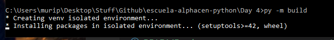
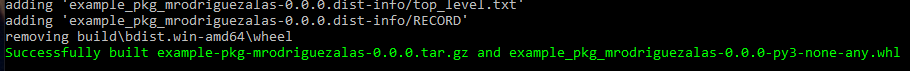
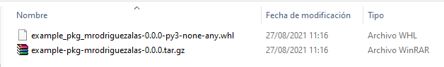
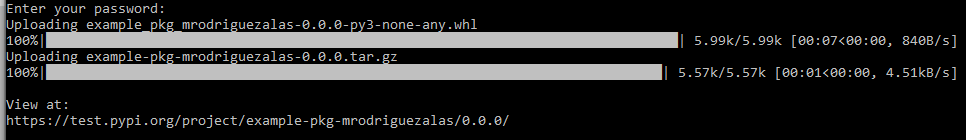
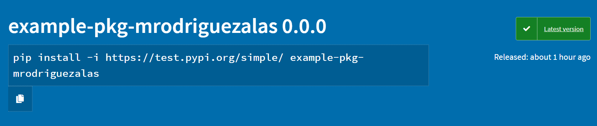

## ¿Cómo publico mi paquete en PyPi Test?

Antes de comenzar debe tener instalado [Python](https://www.python.org/downloads/)
1. Instalar la última versión de pip desde Anaconda o una terminal
`pip install --upgrade pip`
2. Crear una estructura de carpetas similar a esta, donde "example_package" será el nombre de nuestro paquete.

```
tutorial_paquete/
└── src/
    └── example_package/
        ├── __init__.py
        └── example.py
```

`__init__.py` es necesario para importar el paquete y deberá estar vacío. 
`example_.py` es donde viven nuestras funciones de nuestro paquete.
3. Agregar sus funciones, clases, lógica a `example.py`. Para este ejemplo lo mantendremos simple. Dentro de `example.py` agregue sus funciones. Si aún no tiene funciones aquí hay un ejemplo:
```
def add_one(number):
    return number + 1
```

4. Crear un archivo `LICENSE` para la licencia y agregar el siguiente texto
```
Copyright (c) 2018 The Python Packaging Authority

Permission is hereby granted, free of charge, to any person obtaining a copy
of this software and associated documentation files (the "Software"), to deal
in the Software without restriction, including without limitation the rights
to use, copy, modify, merge, publish, distribute, sublicense, and/or sell
copies of the Software, and to permit persons to whom the Software is
furnished to do so, subject to the following conditions:

The above copyright notice and this permission notice shall be included in all
copies or substantial portions of the Software.

THE SOFTWARE IS PROVIDED "AS IS", WITHOUT WARRANTY OF ANY KIND, EXPRESS OR
IMPLIED, INCLUDING BUT NOT LIMITED TO THE WARRANTIES OF MERCHANTABILITY,
FITNESS FOR A PARTICULAR PURPOSE AND NONINFRINGEMENT. IN NO EVENT SHALL THE
AUTHORS OR COPYRIGHT HOLDERS BE LIABLE FOR ANY CLAIM, DAMAGES OR OTHER
LIABILITY, WHETHER IN AN ACTION OF CONTRACT, TORT OR OTHERWISE, ARISING FROM,
OUT OF OR IN CONNECTION WITH THE SOFTWARE OR THE USE OR OTHER DEALINGS IN THE
SOFTWARE.
```
5. Crear un archivo `pyproject.toml`
6. Crear un archivo `README.md`
7. Crear un archivo `setup.cfg`
8. Crear una carpeta `tests/` vacía. Su estructura se verá así
```
packaging_tutorial/
├── LICENSE
├── pyproject.toml
├── README.md
├── setup.cfg
├── src/
│   └── example_package/
│       ├── __init__.py
│       └── example.py
└── tests/
```

9. Dentro de `pyproject.toml` agregar lo siguiente
```
[build-system]
requires = [
    "setuptools>=42",
    "wheel"
]
build-backend = "setuptools.build_meta"
```
`build-system` nos da una lista de paquetes necesarios para nuestro paquete durante la fase de build.
`build-backend` es el objeto que realizará el build. También se pueden utilizar otros backends como `flit` y `poetry`.

10. Configure`setup.cfg` con su información, esta es la configuración para nuestra herramienta, y contiene los metadatos como nombre, versión, cuál código incluir. Mi paquete se ve así, cambie lo necesario para su paquete
```
[metadata]
name = example-pkg-SU_USERNAME_VA_AQUI
version = 0.0.1
author = SU NOMBRE
author_email = SU CORREO
description = Aqui va una pequeña descripción
long_description = file: README.md 
long_description_content_type = text/markdown
url = EL URL A SU GITHUB, SI TIENE
classifiers = 
    Programming Language :: Python :: 3
    License :: OSI Approved :: MIT License
    Operating System :: OS Independent

[options]
package_dir =
    = src
packages = find:
python_requires = >=3.6

[options.packages.find]
where = src
```

NOTA: Si su paquete tiene dependencias de otros paquetes como `numpy, pandas, scikit-image, Pillow` etc, deberá incluir la configuración `install_requires` dentro del archivo `setup.cfg`. Un ejemplo que requiera `numpy, pandas, y astropy` se verá así:

```
[metadata]
name = example-pkg-SU_USERNAME_VA_AQUI
version = 0.0.1
author = SU NOMBRE
author_email = SU CORREO
description = Aqui va una pequeña descripción
long_description = file: README.md 
long_description_content_type = text/markdown
url = EL URL A SU GITHUB, SI TIENE
classifiers = 
    Programming Language :: Python :: 3
    License :: OSI Approved :: MIT License
    Operating System :: OS Independent

[options]
package_dir =
    = src
packages = find:
python_requires = >=3.6
install_requires =
    numpy
    pandas
    astropy

[options.packages.find]
where = s
```

11. Configure `README.md` con la información de su paquete. Actualmente es este documento que está leyendo.

## Crear un build
1. Instalar PyPA con `pip install --upgrade build`
2. Correr desde Windows: `py -m build`, desde Unix/maxOS `python3 -m build` desde el directorio donde se encuentra `pyproject.toml`. Este comando creará dos archivos bajo el directorio `dist/`, estos serán los archivos que se enviarán a PyPi.







3. Crear una cuenta en [PyPi](https://test.pypi.org/account/register/). No olvide su usuario y contraseña.
4. Instalar twine con `py -m pip install --upgrade twine` o `python3 -m pip install --upgrade twine` desde Unix/macOS.
5. Subir nuestro paquete al repositorio de pruebas de PyPi con `py -m twine upload --repository testpypi dist/*`. Introduzca su usuario y contraseña creado en el paso anterior.
6. Listo, si todo está bien debería tener su paquete publicado en el índice de pruebas de PyPi



Con el URL de la imagen anterior podemos ver la página de nuestro paquete y cómo instalarlo y compartirlo




This is a simple example package. You can use
[Github-flavored Markdown](https://guides.github.com/features/mastering-markdown/)
to write your content.

Para las instrucciones en formato web y en inglés siga el siguiente [enlace](https://packaging.python.org/tutorials/packaging-projects/)